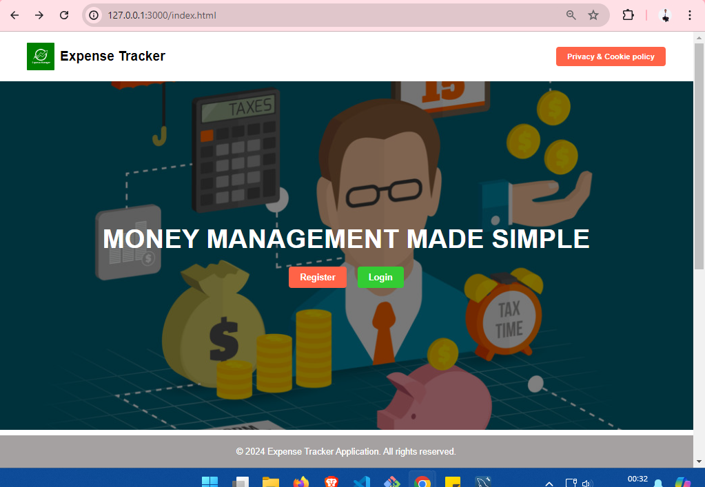
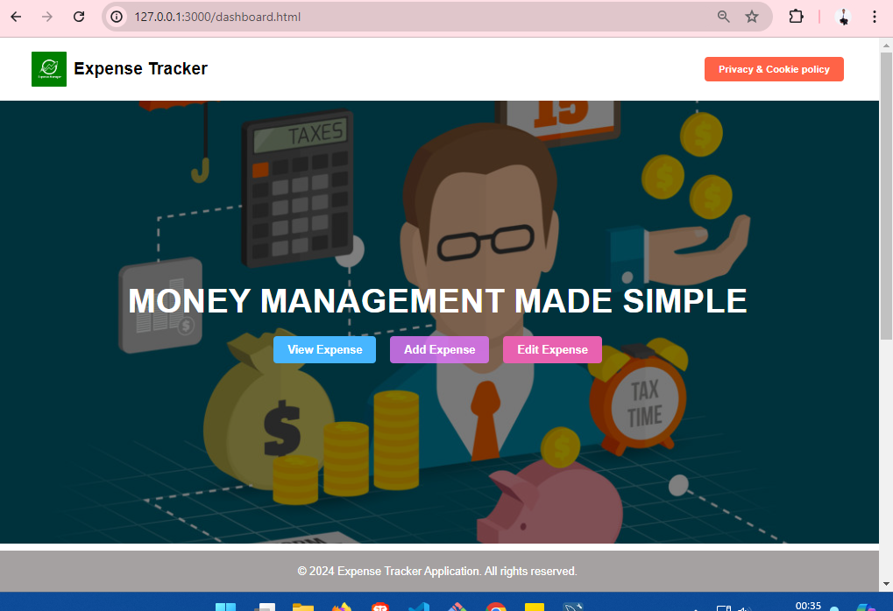

Guide to Using the Expense Tracker Application
1. Register as a New User
To use the expense tracker app, you first need to create a new user account.

Steps to Register:
Open the Registration Page:

Navigate to the registration page, usually found at register.html.
Fill Out the Registration Form:

Username: Enter a unique username (e.g., johndoe).
Email: Provide a valid email address (e.g., johndoe@example.com).
Password: Create a strong password. Ensure it's secure by using a mix of letters, numbers, and special characters.
Submit the Form:

Click the "Register" button.
If the registration is successful, you'll see a confirmation message and be redirected to the login page.
If there are any errors (e.g., the username or email is already taken), an error message will be displayed.
Check Your Email (Optional):

Some applications send a confirmation email. Check your inbox and follow any additional steps if required.
2. Log In Using Your Registration Details
After registering, you can log in to access the expense management features.

Steps to Log In:
Open the Login Page:

Navigate to the login page, usually found at login.html.
Enter Your Credentials:

Email: Enter the email address you used during registration.
Password: Enter your password.
Submit the Form:

Click the "Login" button.
If the login is successful, you'll receive a JSON Web Token (JWT) and be redirected to the dashboard or main application page.
If login fails (e.g., incorrect credentials), an error message will be displayed.
Token Storage:

The JWT token is stored in local storage for subsequent requests. It is used to authenticate you for accessing restricted features.
3. Access Expense Management Features
Once logged in, you have access to the following features. You cannot access these features without being logged in.

(a) View Expenses
Navigate to the Expenses Page:

Go to the page where expenses are displayed (e.g., expenses.html).
Authenticate:

The page will use your JWT token to fetch and display your expenses from the server.
You should see a list of all your expenses, including details like amount, category, and date.
(b) Add Expenses
Open the Add Expense Form:

Navigate to the form for adding expenses (e.g., add-expense.html).
Fill Out the Expense Details:

Description: Enter a brief description of the expense (e.g., "Lunch at cafe").
Amount: Enter the amount spent (e.g., $15.00).
Category: Choose a category (e.g., "Food", "Transportation").
Submit the Form:

Click the "Add Expense" button.
The expense will be sent to the server and stored in the database. You should see a confirmation message and possibly a refreshed list of expenses.
(c) Edit Expenses
Navigate to the Expense List:

Go to the page displaying your expenses (e.g., expenses.html).
Select the Expense to Edit:

Find the expense you want to modify and click the "Edit" button next to it.
Update the Expense Details:

Modify the description, amount, or category as needed.
Submit the Changes:

Click the "Save Changes" button.
The updated information will be sent to the server. You should see a confirmation message and the updated expense details in your list.